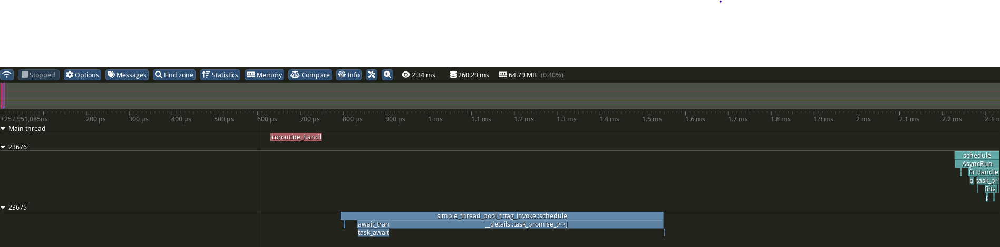

# WIP CoroutineFlow - A Simple coroutine library 
Lightweight c++23 coroutine abstraction layer. If you are looking for a coroutine implementation that it not tight-coupled to a certain scheduler or a complex architecture.

## Overview 

### Simple integration
The goal is to have a coroutine library which requires really small amount of customization. Basically, having a one-liner function which allows the user to customaze a given thread pool behind the coroutine execution flow.

It is achieved via the [tag_invoke](https://open-std.org/JTC1/SC22/WG21/docs/papers/2019/p1895r0.pdf) concept. (The tag_invoke implementation is based on Eric's [prototype implementation](https://gist.github.com/ericniebler/056f5459cf259da526d9ea2279c386bb))
```c++
namespace cf = coroutine_flow;

// Customization code
void tag_invoke(cf::schedule_task_t&&,
                SomeThreadPool* thread_pool,
                std::function<void()> callback)
{
  thread_pool->enque(std::move(callback));
}
```
### Separation of Concerns
The other key aspect is the where to run the coroutine. A couroutine doesn't defines the scheduler or thread where it runs by default. It makes easier to separate the different concerns.
```c++
// Coroutine definitions
cf::task<> some_concurrent_task()
{
    co_return;
}
cf::task<int> coroutine()
{
    // No scheduler/thread_pool magic
    co_await some_concurrent_task();
    co_return 2;
}
```

### Easy call
The 3rd aspect is the easy usage. When one calls a coroutine can decide on which scheduler should be used.
```c++
// Simple usage
int main()
{
    // Running in the background
    cf::run_async(coroutine(), thread_pool);

    // Running blocking
    int result = cf::sync_wait(coroutine(), thread_pool);
}
```

## Simple doesn't mean Stupid

WIP 

TODO:

Support of different 'extensions'. `std::future` or `stdexec::sender` or whatever.

### Tracy Integration

This library optionally integrates tracy. With this one can easily follow what really happens when coroutines are executed with a certain scheduler.



## Stability

Current Test Coverage: 83%. [See the llvm report](./documentation/coverage.report)

Currently 84 tests are defined to check
 - proper allocations/deallocations (promises and awaiters as well)
 - Different return types
 - Exception handlings
 - Execution flow (with injection to be able to simulate some edge cases)

Why not 100% Coverage?
Template execution causes some glitch in the measurements and right now only `std::promise` can be used as the result receiver. And `std::promise` doesn't support classes that are not moveable but copiable.
